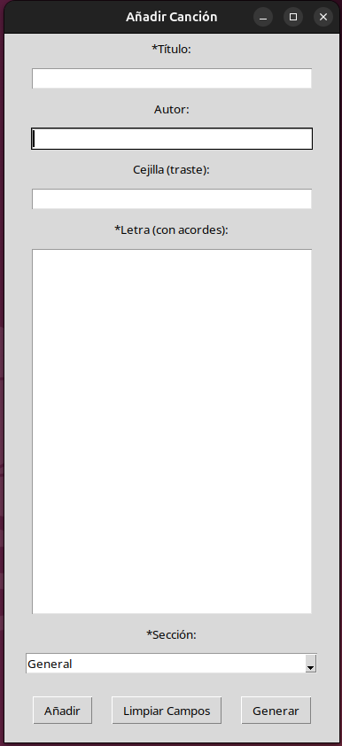
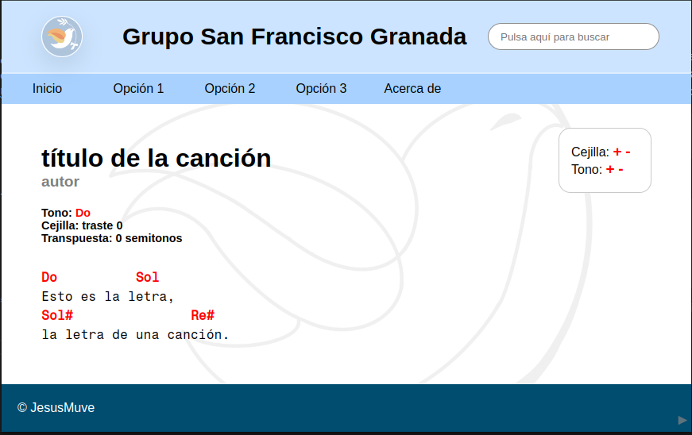

# SF_songs

Repositorio de la página https://jesusmuve18.github.io/SF_songs/

## Descripción

Este repositorio se ha hecho con el objetivo de escribir y almacenar canciones de una forma sencilla y rápida, de forma que se puedan ver en cualquier dispositivo para poder tocarlas en el piano o la guitarra (principalmente). 

## Utilidades

### Lectura y generación automática de canciones (desde la interfaz)

Se ha desarrollado una pequeña <a href="./python/add_songs.py">aplicación</a> para añadir canciones a la página. La interfaz gráfica es muy simple y tiene la siguiente estructura:
<center>
    
</center>
De momento solo funciona en sistemas UNIX con el intérprete */bin/bash*. Consta de los siguientes campos:

- **Título:** título de la canción
- **Autor:** autor de la canción
- **Cejilla (traste):** Número de traste de la cejilla (en el caso de que haya que ponerla)
- **Letra (con acordes):** Letra y acordes de la canción con el formato que se indicará posteriormente.
- **Botones:**
  - **Añadir canción:** Añade la canción a la base de datos (crea los archivos correspondientes).
  - **Limpiar campos:** Vacía todos los campos de la interfaz.
  - **Generar:** Lee toda la base de datos creando los archivos *html* necesarios y añadiendo todas las canciones al índice.

### Lectura y generación automática de canciones (creando el archivo)

Se ha desarrollado un <a href="./scripts/generate.sh">script</a> que lee una canción escrita en texto plano y reconoce automáticamente los acordes y la letra para su correcta visualización, creando un documento html asociado con la canción. Para ello, la canción deberá estar ubicada en el directorio **cpp/songs/** y el formato del nombre del archivo debe ser: **título_de_la_canción-autor.dat** para que se pueda reconocer automáticamente el título y el autor (o subtítulo). La ejecución debe ser de la forma:
```bash
$ ./scripts/generate.sh ./cpp/songs/nombre_de_la_canción-autor.dat
```

Por ejemplo, si tenemos el archivo **título_de_la_canción-autor.dat** que contiene el siguiente texto:
```
C          Sol
Esto es la letra,
Ab               D#
la letra de una canción.
```
y ejecutamos la línea anterior se generará el archivo **songs/título_de_la_canción-autor.html** cuya visualización será:

<center>
    
</center>

Además, existe otro <a href="./scripts/generate-all.sh">script</a> que genera todas las canciones del directorio **cpp/songs/** y además las añade al índice de la <a href="./index.html">página principal</a>.
Su ejecución será: 

```bash
$ ./scripts/generate-all.sh
```

Se recomienda que los archivos **.dat** tengan una longitud máxima de 39 caracteres por línea (para su correcta visualización en todos los dispositivos).

### Generación automática de diagramas de acordes

Se ha desarrollado otro <a href="./latex/svg_maker.sh">script</a> que convierte el diagrama de acordes generado en **latex/diagram_maker.tex** gracias al paquete **jmvsong** (proyecto cuyo repositorio pronto se subirá a github donde aparecerá su uso) a un formato de archivo **svg**. Para ello, será necesario tener instalada la herramienta **pdf2svg** disponible en cualquier sistema operativo.

Su uso debe ser:
```bash
$ cd latex
$ ./svg_maker.sh nombre_acorde
```

De esta forma se generará un archivo en el directorio **images/svg_chords** con el nombre **nombre_acorde.svg** que estará listo para su visualización en la web. El nombre deberá estar en notación americana con bemoles para que se encuentre correctamente cuando aparezca en la canción.

Por ejemplo, si el archivo **latex/diagram_maker.tex** contiene dentro del cuerpo:
```tex
\begin{document} 
   
\thispagestyle{empty}

\vddiagram[%
nombre=La\#,
variacion=m7,
trasteinicial=1,
iniciocejilla=5,
cejilla=1,
fprimera=1,
fsegunda=2,
ftercera=1,
fcuarta=3,
fquinta=1,
fsexta=,]%
{1}{2}{1}{3}{1}{x}

\end{document}
```

y se ejecuta en la terminal el comando 
```bash
$ cd latex
$ ./svg_maker.sh Bbm7
```

Se generará el archivo **images/svg_chords/Bbm7.svg** que contendrá el siguiente **svg**:

<center>
<div style="background-color: white; display: inline-block; margin: 20px;">
        
</div>
</center>

Cuando en una canción se encuentre el acorde de **La#m7** (o cualquier notación que haga referencia al mismo acorde) se buscará automáticamente el archivo de imagen que acabamos de generar.

### Cambio de cejilla y de tono

En las páginas de canciones generadas aparece un cuadro que permite cambiar de cejilla y de tono. Automáticamente se calcularán los acordes resultantes de dichas modificaciones. Su uso está más desarrollado en <a href="./about.html">acerca de</a>. 

### Scroll

En la esquina inferior izquierda hay un icono que permite reanudar o pausar el scroll automático. La velocidad es ajustable con el deslizable que aparece.

### Visualización de acordes

Al pasar el ratón por encima de un acorde de una canción aparecerá en el centro de la página la representación del diagrama de dicho acorde (si existe en la base de datos). En el caso de que la visualización se haga desde un dispositivo móvil se deberá clicar el nombre del acorde.

## Formato de las canciones

El formato de las canciones deberá ser en texto plano y que la visualización sea correcta al usar una fuente monoespaciada (que los acordes queden en su sitio al usar esta fuente). Para la correcta visualización en todos los dispositivos, el ancho de línea deberá ser de 39 caracteres como máximo (la interfaz de python ya incorpora este ancho).

El programa que lee las canciones y les da formato funciona de la siguiente manera:
- Reconoce lo que es una línea de acordes de lo que no. Para ello, todas las "palabras" de dicha línea deberán ser acordes o palabras reservadas. De momento la lista de palabras reservadas es la siguiente (palabras que pueden aparecer en la misma línea que un acorde):
    ```cpp
    reserved = { "Intro:", "Final:", "**", "***", "****", "2ª", "2ª:", "1ª:", "2º:", "1º:", "vez:", "-"};
    ```
    Esta lista se encuentra en el archivo <a href="./cpp/dictionary.cpp">dictionary.cpp</a> y se podrá editar para añadir más palabras.

    Es por esto que si alguna vez al añadir una canción una línea de acordes no se visualiza correctamente es posible que haya alguna palabra no permitida o algún acorde mal escrito.

Las notaciones permitidas para escribir los acordes son:
- **Europea:** Cualquiera de las notas 
  ```cpp
  "Do", "Do#", "Re", "Re#", "Mi", "Fa", "Fa#", "Sol", "Sol#", "La", "La#", "Si", "Reb", "Mib", "Solb", "Lab", "Sib"
  ```
  con la primera letra en mayúscula o minúscula y la segunda siempre en minúscula, acompañada de cualquier variación que empiece por
  ```cpp
  "M", "m", "7", "6", "5", "4", "9", "11", "13", "2",  "aug", "dim", "sus", "add", " ", "/", "+", "-", "maj"
    ```
- **Americana:** Cualquiera de las notas
  ```cpp
  "C", "C#", "D", "D#", "E", "F", "F#", "G", "G#", "A", "A#", "B", "Db", "Eb", "Gb", "Ab", "Bb"
  ```
  Acompañada de cualquiera de las variaciones antes mencionadas

Independientemente de la notación elegida, las notas se traducirán a un formato legible por javaScript para poder interpretarlo en el HTML y su visualización en la aplicación web será por defecto la europea y utilizando el símbolo "\#". Si se quiere visualizar en notación americana o con los signos "b" se podrá ajustar cambiando la variable *notation* en el archivo <a href="./scripts.js">scripts.js</a>. Las posibles combinaciones son:
```javascript
let notation = [EUROPE, SHARP];  // Por defecto
let notation = [EUROPE, FLAT];
let notation = [AMERICAN, SHARP];
let notation = [AMERICAN, FLAT];
```
También se podrá cambiar desde el archivo *html* mediante la línea
```html
<div id="notation">europe sharp</div>
```
Con las mismas combinaciones anteriormente mencionadas.

Por el funcionamiento del programa que traduce las canciones es posible que se produzca algún error en la traducción. Por ejemplo si aparece en una línea únicamente la palabra "Amen", el intérprete podría pensar que se trata de un "A" (La) "m" (menor) y con algún tipo de variación añadida "en". Para evitar esto, de momento bastará con incluir algún caracter "ilegal" para una línea de acordes, por ejemplo *\&nbsp;* al final de la línea, que añadiría un caracter en blanco (y no se vería en el *html*).

Para añadir una cejilla (por defecto) se deberá ubicar en cualquier lugar del archivo de la canción (preferentemente al final) la siguiente sentencia:
```html
<span id="cejilla-original"> num-traste </span>
```
donde *num-traste* es solo un número.